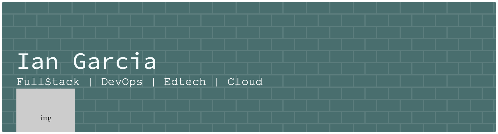

<h2>Principais Ferramentas: </h2>

  
  
  
  
  
  
  
  
  
  
  
  
  
  
  
          
  

<h2>Conhecimentos:</h2>

Infraestrutura e DevOps: Windows Server, Active Directory, Linux, Virtualização, Docker, Terraform, AWS, Microsoft 365 admin   

Programação: Python, SQL (SQL Server, PostgreeSQL, SQLite), JavaScript, HTML/CSS, Git/GitHub, APIs    

EdTech: Google Workspace for Education, Microsoft 365 Education, Moodle Admin    

Redes: Fundamentos de redes (Modelo OSI, TCP/UDP), serviços de rede (DNS e DHCP), redes LAN e VPN, configuração básica de roteadores e switches, noções de firewall e troubleshooting de conectividade  

